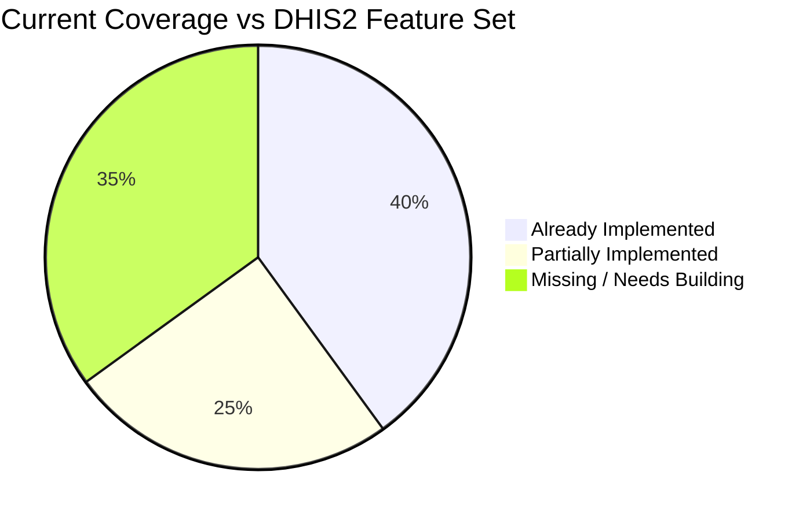

# DHIS2-Style Reporting System — Gap Analysis & Required Changes

> Comparing your current Measles Outbreak Monitoring Platform against DHIS2's Dataset/Form architecture

---

## Executive Summary

Your system already has a **solid foundation** — dynamic form fields, multi-outbreak support, RBAC, audit logging, and export capabilities. However, to reach DHIS2-level reporting infrastructure, you need **13 major enhancements** across schema redesign, workflow engines, and UI tooling.



---

## Feature-by-Feature Comparison

### ✅ What You Already Have (Working Well)

| DHIS2 Concept | Your Equivalent | Status |
|---|---|---|
| Organisation Units | `Facility` (Division → District → Upazila) | ✅ Functional |
| Data Sets (basic) | `Outbreak` + `FormField` | ✅ Functional |
| Data Entry Form | `UnifiedReportForm` + public `page.tsx` | ✅ Functional |
| User Roles | `Role` enum (ADMIN, EDITOR, USER, VIEWER) | ✅ Functional |
| Audit Trail | `AuditLog` with 21 action types | ✅ Functional |
| Report Locking | `isLocked` on `DailyReport` | ✅ Functional |
| Report Publishing | `published` flag + bulk publish API | ✅ Functional |
| Time-based Cutoffs | `cutoffHour/cutoffMinute` settings | ✅ Functional |
| PDF/Excel Export | jsPDF + SheetJS | ✅ Functional |
| i18n | Bengali + English | ✅ Functional |
| GIS Mapping | Leaflet outbreak map | ✅ Functional |
| Backlog Reporting | Per-outbreak + global config | ✅ Functional |

### ⚠️ Partially Implemented (Needs Enhancement)

| DHIS2 Concept | Your Current State | Gap |
|---|---|---|
| **Form Builder** | Admin can add/edit/reorder fields with arrow buttons | No drag-and-drop; no table/matrix layouts; no row/column spanning |
| **Completeness Tracking** | `/admin/submissions` shows who submitted vs not | No formal `CompletionRecord` model; no auto-generated expected-reports list; no timeliness tracking |
| **Analytics** | `EpiInsights` (Rₜ, trends, growth, MA); dashboard KPIs | No configurable indicators; no custom indicator builder; no data element–based formulas |
| **Data Validation** | `isRequired` flag on fields; JS `required` attribute | No cross-field validation rules (e.g. deaths ≤ cases); no min/max outlier detection |
| **Organisation Unit Hierarchy** | Flat: Division → District → Upazila (hardcoded constants) | Not a proper tree model; can't add/reorganize units; no org unit groups |

### ❌ Missing (Needs to be Built)

| DHIS2 Concept | Description | Priority |
|---|---|:---:|
| **Dataset Abstraction** | Named collection with period type, org unit assignment, completeness expectations | 🔴 Critical |
| **Data Element Registry** | Global, reusable data elements across datasets (not outbreak-scoped) | 🔴 Critical |
| **Category Combinations** | Disaggregation dimensions (age groups, sex, etc.) creating matrix tables | 🟡 High |
| **Validation Rules Engine** | `LEFT_SIDE operator RIGHT_SIDE` with expressions across data elements | 🟡 High |
| **Multi-Level Approval Workflow** | District → Division → National approval chain | 🟡 High |
| **Period Type System** | Daily, Weekly, Monthly, Quarterly, Yearly — not just "daily" | 🟡 High |
| **Indicator Engine** | Configurable computed metrics: `numerator / denominator × factor` | 🟠 Medium |
| **Section/Custom Form Layouts** | Drag-and-drop table/grid designer for form appearance | 🟠 Medium |
| **Data Element Groups** | Logical grouping beyond sections (e.g. "Core EPI indicators") | 🟢 Low |
| **Min/Max Outlier Detection** | Automatic statistical outlier flags on data entry | 🟢 Low |
| **Data Value History** | Per-cell audit trail (who changed what, when) | 🟢 Low |
| **Messaging / Notifications** | In-app notifications for pending approvals, missed reports | 🟢 Low |

---

## Detailed Required Changes

### 1. 🔴 Dataset Abstraction Layer

**Problem**: Your `Outbreak` model conflates disease tracking metadata with form/reporting configuration. DHIS2 separates "Dataset" (the reporting template) from the disease context.

**Schema Changes**:

```prisma
// NEW MODEL — replaces the form-management role of Outbreak
model Dataset {
  id            String         @id @default(cuid())
  name          String
  code          String         @unique
  description   String?
  periodType    PeriodType     @default(DAILY)
  outbreakId    String?        // Optional link to disease outbreak context
  isActive      Boolean        @default(true)
  expiryDays    Int            @default(0)   // Days after period end when entry is blocked
  openFuturePeriods Int        @default(0)   // How many future periods can be opened
  createdAt     DateTime       @default(now())
  updatedAt     DateTime       @updatedAt

  // Relations
  outbreak      Outbreak?      @relation(fields: [outbreakId], references: [id])
  sections      DatasetSection[]
  assignments   DatasetAssignment[]  // Which OrgUnits must report
  reports       DataEntryRecord[]
}

enum PeriodType {
  DAILY
  WEEKLY
  MONTHLY
  QUARTERLY
  YEARLY
}

// Assign datasets to specific org units (facilities)
model DatasetAssignment {
  id          String   @id @default(cuid())
  datasetId   String
  facilityId  String
  createdAt   DateTime @default(now())

  dataset     Dataset  @relation(fields: [datasetId], references: [id])
  facility    Facility @relation(fields: [facilityId], references: [id])

  @@unique([datasetId, facilityId])
}
```

**Impact**: 
- Every Facility gets explicitly assigned to datasets → enables proper completeness tracking  
- Period type enables weekly/monthly aggregation  
- `expiryDays` replaces your global `cutoffHour` logic per-dataset

---

### 2. 🔴 Data Element Registry

**Problem**: Your `FormField` is scoped to an outbreak. The same "Suspected Cases (24h)" field is recreated for each new outbreak. DHIS2 has a **global** data element catalog.

**Schema Changes**:

```prisma
// NEW — Global data element catalog (replaces FormField's field definition role)
model DataElement {
  id            String           @id @default(cuid())
  name          String
  code          String           @unique
  shortName     String?
  nameBn        String?          // Bengali translation
  description   String?
  valueType     ValueType        @default(NUMBER)
  aggregationType AggregationType @default(SUM)
  zeroIsSignificant Boolean      @default(false)
  optionSetId   String?
  createdAt     DateTime         @default(now())
  updatedAt     DateTime         @updatedAt

  optionSet     OptionSet?       @relation(fields: [optionSetId], references: [id])
  sectionElements SectionElement[]
  dataValues    DataValue[]
  categories    CategoryComboAssignment[]
}

enum ValueType {
  NUMBER
  INTEGER_POSITIVE
  INTEGER_ZERO_OR_POSITIVE
  TEXT
  LONG_TEXT
  BOOLEAN
  DATE
  PERCENTAGE
}

enum AggregationType {
  SUM
  AVERAGE
  COUNT
  MIN
  MAX
  NONE
}

// Option sets for SELECT-type data elements
model OptionSet {
  id        String       @id @default(cuid())
  name      String
  options   Option[]
  elements  DataElement[]
}

model Option {
  id          String    @id @default(cuid())
  name        String
  code        String
  sortOrder   Int       @default(0)
  optionSetId String
  optionSet   OptionSet @relation(fields: [optionSetId], references: [id])
}
```

**Migration Path**:
- Your existing `FormField` records become `DataElement` entries
- The `fieldKey` maps to `DataElement.code`
- The `options` JSON string becomes a proper `OptionSet` relation
- `FormField.section` moves to `DatasetSection` (see below)

---

### 3. 🟡 Section & Layout System

**Problem**: Your form renders sections programmatically from the `section` field. DHIS2 allows admins to create **custom section layouts** with row/column configuration.

**Schema Changes**:

```prisma
// Sections within a dataset
model DatasetSection {
  id          String           @id @default(cuid())
  datasetId   String
  name        String
  nameBn      String?
  sortOrder   Int              @default(0)
  showRowTotals Boolean        @default(false)
  showColumnTotals Boolean     @default(false)

  dataset     Dataset          @relation(fields: [datasetId], references: [id])
  elements    SectionElement[]
}

// Junction: which data elements appear in which section, in what order
model SectionElement {
  id              String         @id @default(cuid())
  sectionId       String
  dataElementId   String
  sortOrder       Int            @default(0)
  
  section         DatasetSection @relation(fields: [sectionId], references: [id])
  dataElement     DataElement    @relation(fields: [dataElementId], references: [id])

  @@unique([sectionId, dataElementId])
}
```

**UI Changes**:
- Replace current form builder (`/admin/form-fields`) with:
  1. **Data Element Manager** — global registry, CRUD, option sets
  2. **Dataset Designer** — create sections, drag data elements into sections, set row/column layout
  3. **Form Preview** — live preview when designing

---

### 4. 🟡 Category Combinations (Disaggregation)

**Problem**: You capture a single `suspected24h` number. DHIS2 allows breaking that down by dimensions like age group + sex, creating a **matrix input table**.

**Schema Changes**:

```prisma
model Category {
  id      String           @id @default(cuid())
  name    String           @unique  // e.g. "Age Group", "Sex"
  options CategoryOption[]
  combos  CategoryComboCategory[]
}

model CategoryOption {
  id         String   @id @default(cuid())
  name       String   // e.g. "0-11 months", "1-4 years", "5-14 years", "15+"
  categoryId String
  sortOrder  Int      @default(0)
  category   Category @relation(fields: [categoryId], references: [id])
}

model CategoryCombo {
  id         String                    @id @default(cuid())
  name       String                    @unique  // e.g. "Age + Sex"
  categories CategoryComboCategory[]
  assignments CategoryComboAssignment[]
}

model CategoryComboCategory {
  id              String        @id @default(cuid())
  categoryComboId String
  categoryId      String
  categoryCombo   CategoryCombo @relation(fields: [categoryComboId], references: [id])
  category        Category      @relation(fields: [categoryId], references: [id])

  @@unique([categoryComboId, categoryId])
}

// Assign a category combo to a data element
model CategoryComboAssignment {
  id              String        @id @default(cuid())
  dataElementId   String
  categoryComboId String
  dataElement     DataElement   @relation(fields: [dataElementId], references: [id])
  categoryCombo   CategoryCombo @relation(fields: [categoryComboId], references: [id])

  @@unique([dataElementId, categoryComboId])
}
```

**Rendering**: When a data element has a category combo, the form renders it as a **table** with category options as column headers, e.g.:

| Suspected Cases | 0-11mo | 1-4yr | 5-14yr | 15+ | **Total** |
|---|---|---|---|---|---|
| Male | `__` | `__` | `__` | `__` | auto |
| Female | `__` | `__` | `__` | `__` | auto |
| **Total** | auto | auto | auto | auto | auto |

---

### 5. 🟡 Validation Rules Engine

**Problem**: You only have `isRequired`. DHIS2 allows complex cross-field rules.

**Schema Changes**:

```prisma
model ValidationRule {
  id             String   @id @default(cuid())
  name           String
  description    String?
  importance     String   @default("WARNING")  // WARNING | ERROR
  operator       String   // equal_to, not_equal_to, greater_than, less_than, etc.
  leftSide       String   // Expression: e.g. "#{confirmed_deaths}"
  rightSide      String   // Expression: e.g. "#{confirmed_cases}"
  periodType     PeriodType?
  datasetId      String?
  isActive       Boolean  @default(true)
  createdAt      DateTime @default(now())
}
```

**Example rules**:
- `#{confirmedDeath24h} <= #{confirmed24h}` — Deaths can't exceed confirmed cases
- `#{discharged24h} <= #{admitted24h}` — Discharges can't exceed admissions
- `#{confirmed24h} <= #{suspected24h}` — Confirmed ≤ Suspected

**UI Changes**:
- Add a validation rule builder in admin
- Run validation client-side on form submit (show warnings/errors)
- Run validation server-side in the API (block or warn)

---

### 6. 🟡 Multi-Level Approval Workflow

**Problem**: You have `published` and `isLocked` as binary flags. DHIS2 has a **staged approval workflow**: Data Entry → District Review → Division Approval → National Approval.

**Schema Changes**:

```prisma
enum ApprovalStatus {
  PENDING
  APPROVED
  REJECTED
  RETURNED
}

model ApprovalLevel {
  id          String   @id @default(cuid())
  name        String   // e.g. "District", "Division", "National"
  level       Int      @unique  // 1 = lowest (District), 3 = highest (National)
  approvals   Approval[]
}

model Approval {
  id              String         @id @default(cuid())
  reportId        String
  approvalLevelId String
  status          ApprovalStatus @default(PENDING)
  approvedBy      String?        // userId
  comments        String?
  approvedAt      DateTime?
  createdAt       DateTime       @default(now())

  report          DailyReport    @relation(fields: [reportId], references: [id])
  approvalLevel   ApprovalLevel  @relation(fields: [approvalLevelId], references: [id])
  approver        User?          @relation(fields: [approvedBy], references: [id])

  @@unique([reportId, approvalLevelId])
}
```

**Workflow**:
1. Facility submits → `PENDING` at District level
2. District EDITOR approves → `PENDING` at Division level  
3. Division EDITOR approves → `PENDING` at National level
4. National ADMIN approves → `APPROVED` (auto-publishes)
5. At any level, can `RETURN` with comments → goes back to submitter

**RBAC Changes**: Add `report:approve:district`, `report:approve:division`, `report:approve:national` permissions.

---

### 7. 🟡 Period Type System

**Problem**: Your system only supports daily reporting. Some datasets need weekly or monthly aggregation.

**Changes needed in** `DataEntryRecord` (replaces `DailyReport`):

```prisma
model DataEntryRecord {
  id            String     @id @default(cuid())
  datasetId     String
  facilityId    String
  userId        String
  period        String     // ISO period: "2026-04-10" (daily), "2026-W15" (weekly), "2026-04" (monthly)
  periodType    PeriodType
  isComplete    Boolean    @default(false)
  isLocked      Boolean    @default(false)
  completedAt   DateTime?
  completedBy   String?
  createdAt     DateTime   @default(now())
  updatedAt     DateTime   @updatedAt

  dataset       Dataset    @relation(fields: [datasetId], references: [id])
  facility      Facility   @relation(fields: [facilityId], references: [id])
  user          User       @relation(fields: [userId], references: [id])
  values        DataValue[]
  approvals     Approval[]

  @@unique([datasetId, facilityId, period])
}

model DataValue {
  id              String          @id @default(cuid())
  recordId        String
  dataElementId   String
  categoryOptionCombo String?     // For disaggregated values
  value           String
  comment         String?
  storedBy        String?         // userId who last modified
  lastUpdated     DateTime        @default(now())
  followup        Boolean         @default(false)  // Flagged for review

  record          DataEntryRecord @relation(fields: [recordId], references: [id], onDelete: Cascade)
  dataElement     DataElement     @relation(fields: [dataElementId], references: [id])

  @@unique([recordId, dataElementId, categoryOptionCombo])
}
```

**Key difference**: `DataValue` stores individual cell values with optional `categoryOptionCombo` for disaggregation, replacing both your `DailyReport` fixed columns AND `ReportFieldValue`.

---

### 8. 🟠 Configurable Indicator Engine

**Problem**: Your analytics (CFR, confirmation rate, Rₜ) are hardcoded in `EpiInsights.tsx` and `dashboard/page.tsx`.

**Schema**:

```prisma
model Indicator {
  id             String   @id @default(cuid())
  name           String
  shortName      String?
  description    String?
  numerator      String   // Expression: "#{confirmed_deaths_24h}"
  denominator    String   // Expression: "#{confirmed_cases_24h}"
  factor         Int      @default(100)  // multiply by (e.g. 100 for percentages)
  indicatorType  String   @default("PERCENTAGE")  // PERCENTAGE, RATIO, NUMBER
  decimals       Int      @default(2)
  createdAt      DateTime @default(now())
}
```

**Example indicators**:
| Name | Numerator | Denominator | Factor | Type |
|---|---|---|---|---|
| Case Fatality Rate | `#{confirmedDeath24h}` | `#{confirmed24h}` | 100 | PERCENTAGE |
| Confirmation Rate | `#{confirmed24h}` | `#{suspected24h}` | 100 | PERCENTAGE |
| Hospitalization Rate | `#{admitted24h}` | `#{suspected24h}` | 100 | PERCENTAGE |

**UI**: Admin page to create/edit indicators, then dashboard dynamically computes and displays them.

---

### 9. 🟡 Organisation Unit Hierarchy

**Problem**: Your Division → District → Upazila is hardcoded in `constants.ts`. You can't add, remove, or reorganize units.

**Schema Changes**:

```prisma
model OrganisationUnit {
  id        String              @id @default(cuid())
  name      String
  code      String              @unique
  level     Int                 // 1=National, 2=Division, 3=District, 4=Upazila, 5=Facility
  parentId  String?
  path      String              // Materialized path: "/national/dhaka/gazipur/"
  isActive  Boolean             @default(true)
  latitude  Float?
  longitude Float?
  
  parent    OrganisationUnit?   @relation("OrgUnitTree", fields: [parentId], references: [id])
  children  OrganisationUnit[]  @relation("OrgUnitTree")
  
  @@index([parentId])
  @@index([level])
  @@index([path])
}
```

**Migration**: Convert your `Facility` table + `constants.ts` into a proper org unit tree. The `Facility` model becomes level 5 in the hierarchy.

---

### 10. 🟠 Drag-and-Drop Form Builder UI

**Current**: Admin creates fields one-by-one with a simple form. Reordering is via up/down arrow buttons.

**Needed**: A visual form designer where admins can:
1. **Search** the global data element registry
2. **Drag** elements into sections
3. **Create sections** with custom names and row/column layout
4. **Reorder** via drag-and-drop (use a library like `@dnd-kit/core`)
5. **Preview** the form as it will appear to data entry users
6. **Configure validation rules** per dataset

**Recommended library**: `@dnd-kit/core` + `@dnd-kit/sortable` for React drag-and-drop.

---

## Migration Strategy

> [!IMPORTANT]  
> This is a **major architectural evolution**. Recommend a phased approach.

### Phase 1: Foundation (Schema) — ~2 weeks
- [ ] Create `DataElement`, `OptionSet`, `Option` models
- [ ] Create `Dataset`, `DatasetSection`, `SectionElement` models
- [ ] Create `DataEntryRecord`, `DataValue` models
- [ ] Write migration scripts to transform existing `FormField` → `DataElement`, `DailyReport` → `DataEntryRecord`, `ReportFieldValue` → `DataValue`
- [ ] Update seed scripts

### Phase 2: Admin Tooling — ~2 weeks
- [ ] Build Data Element Manager page (CRUD + option set management)
- [ ] Build Dataset Designer page (sections + element assignment)
- [ ] Build Validation Rule builder
- [ ] Add form preview

### Phase 3: Data Entry — ~1 week
- [ ] Refactor `UnifiedReportForm` to render from `Dataset` → `DatasetSection` → `DataElement`
- [ ] Refactor public `page.tsx` to use new data model
- [ ] Implement client-side validation rules
- [ ] Update all API routes (`/api/reports`, `/api/public/submit`, etc.)

### Phase 4: Approval Workflow — ~1 week
- [ ] Create `ApprovalLevel`, `Approval` models
- [ ] Build approval UI (approve/reject/return)
- [ ] Add approval status indicators in dashboard
- [ ] Update RBAC with approval permissions

### Phase 5: Category Combos + Disaggregation — ~2 weeks
- [ ] Create `Category`, `CategoryOption`, `CategoryCombo` models
- [ ] Build category management admin UI
- [ ] Implement matrix table rendering in form
- [ ] Update data value storage for disaggregated values

### Phase 6: Indicator Engine + Analytics — ~1 week
- [ ] Create `Indicator` model
- [ ] Build indicator expression parser
- [ ] Replace hardcoded dashboard analytics
- [ ] Build indicator management admin page

### Phase 7: Organisation Unit Hierarchy — ~1 week
- [ ] Create `OrganisationUnit` model
- [ ] Migrate `Facility` + `constants.ts` data
- [ ] Build org unit tree management UI
- [ ] Update all queries to use hierarchical org unit

---

## Summary Table: Current → DHIS2-Style

| Component | Current Files to Modify | New Files Needed |
|---|---|---|
| **Schema** | `schema.prisma` (major rewrite) | Migration scripts |
| **Form Builder** | `admin/form-fields/page.tsx` | `admin/data-elements/`, `admin/datasets/`, `admin/categories/` |
| **Report Form** | `UnifiedReportForm.tsx`, `page.tsx` | `DatasetForm.tsx`, `MatrixInput.tsx` |
| **Submission API** | `api/public/submit/route.ts`, `api/reports/route.ts` | `api/data-entry/route.ts` |
| **Validation** | `api/public/submit/route.ts` | `lib/validation-engine.ts`, `admin/validation-rules/` |
| **Approval** | — (new) | `api/approvals/`, `admin/approvals/`, `ApprovalWorkflow.tsx` |
| **Indicators** | `EpiInsights.tsx`, `dashboard/page.tsx` | `lib/indicator-engine.ts`, `admin/indicators/` |
| **Org Units** | `lib/constants.ts`, `Facility` model | `admin/org-units/`, `OrgUnitTree.tsx` |
| **Completeness** | `admin/submissions/page.tsx` | `api/completeness/`, Enhanced UI |
| **Period Types** | `lib/timezone.ts` | `lib/periods.ts`, Dataset config |

> [!WARNING]
> The schema changes (Phases 1-2) are **breaking changes** that require careful data migration. You'll need to run your existing system in parallel during migration. Plan for 1-2 days of migration testing with production data before cutover.

> [!TIP]
> **Quick wins you can do NOW without breaking changes**:
> 1. Add validation rules as a JSON config in the existing `FormField.options` field
> 2. Add `completedAt` and `completedBy` columns to `DailyReport` for basic completeness tracking
> 3. Add an `ApprovalStatus` enum column to `DailyReport` for a simplified approval workflow
> 4. Create an `Indicator` table and build a basic expression evaluator to replace hardcoded analytics
