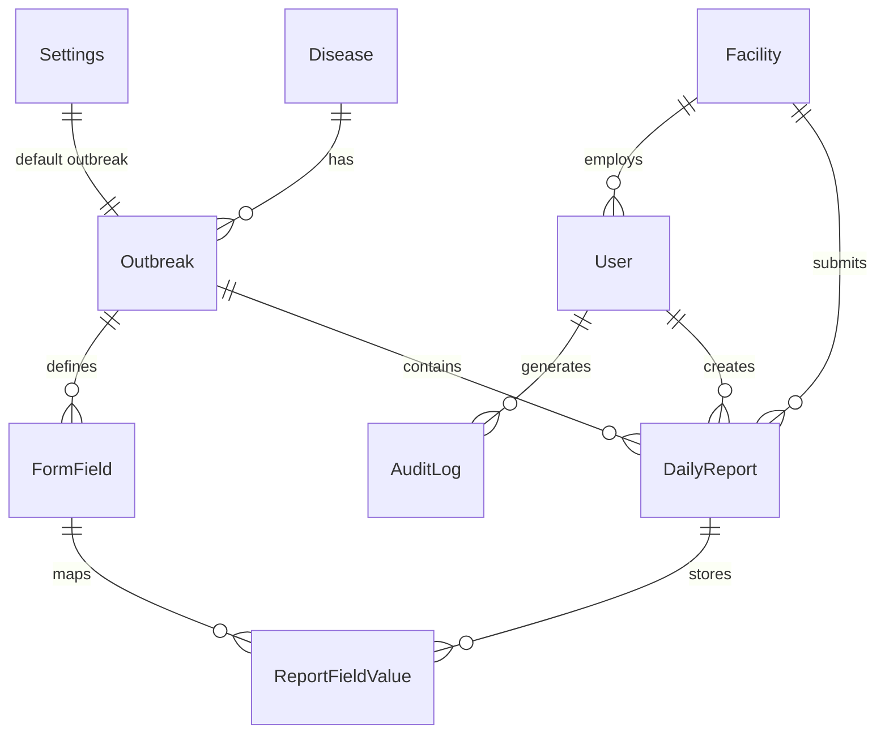

# Multi-Disease Outbreak Monitoring — System Overhaul

Transform the single-disease measles platform into a generalized, multi-disease outbreak monitoring system with dynamic forms, role-based access control, and a scalable data architecture.

---

## User Review Required

> [!IMPORTANT]
> **Breaking Change — `DailyReport` unique constraint change.**  
> The current constraint `@@unique([facilityId, reportingDate])` becomes `@@unique([facilityId, outbreakId, reportingDate])`. This means one facility can submit one report **per outbreak per day** instead of one report per day globally. All existing reports will be backfilled to the `outbreak_measles_2026` outbreak before the constraint changes.

> [!WARNING]
> **Data Migration Required.** Phase 1 includes a backfill migration. The `outbreakId` column on `DailyReport` will initially be nullable to allow the migration, then made required after backfill. Run the migration on a database backup first.

> [!IMPORTANT]
> **RBAC Enforcement.** The new permission model (`ADMIN > MANAGER > USER > VIEWER`) will restrict access across all existing pages. `MANAGER` is a new tier that can view all reports in their division but cannot manage users or system settings. `VIEWER` (already in enum but unused) becomes read-only dashboard access. Confirm this hierarchy is correct.

---

## Proposed Changes

### Phase 1 — Core Schema Refactor (Foundation)

Everything depends on this. No UI changes until this is complete and migrated.

---

#### [MODIFY] [schema.prisma](file:///d:/districtwise-measles-outbreak-monitoring-platform/districtwise-measles-outbreak-monitoring-platform/prisma/schema.prisma)

Add new models and update existing ones:

**New models:**
```prisma
model Disease {
  id          String     @id @default(cuid())
  name        String                          // "Measles", "Dengue", "Cholera"
  code        String     @unique              // "MEASL", "DENG", "CHOL"
  description String?
  isActive    Boolean    @default(true)
  createdAt   DateTime   @default(now())
  updatedAt   DateTime   @updatedAt
  outbreaks   Outbreak[]
}

model Outbreak {
  id         String         @id @default(cuid())
  diseaseId  String
  disease    Disease        @relation(fields: [diseaseId], references: [id])
  name       String                              // "Measles 2026"
  status     OutbreakStatus @default(ACTIVE)
  startDate  DateTime
  endDate    DateTime?
  isActive   Boolean        @default(true)
  createdAt  DateTime       @default(now())
  updatedAt  DateTime       @updatedAt
  reports    DailyReport[]
  formFields FormField[]

  @@index([diseaseId])
  @@index([status])
}

enum OutbreakStatus {
  ACTIVE
  CONTAINED
  CLOSED
}

model FormField {
  id          String    @id @default(cuid())
  outbreakId  String
  outbreak    Outbreak  @relation(fields: [outbreakId], references: [id])
  label       String                             // "Dengue Serotype"
  labelBn     String?                            // Bengali label
  fieldKey    String                             // "dengue_serotype"
  fieldType   FieldType @default(NUMBER)
  options     String?                            // JSON string for SELECT options
  section     String?                            // Group header: "Lab Data"
  isRequired  Boolean   @default(false)
  sortOrder   Int       @default(0)
  activeFrom  DateTime?
  activeTo    DateTime?
  createdAt   DateTime  @default(now())
  updatedAt   DateTime  @updatedAt
  fieldValues ReportFieldValue[]

  @@unique([outbreakId, fieldKey])
  @@index([outbreakId])
}

enum FieldType {
  NUMBER
  TEXT
  SELECT
  DATE
  BOOLEAN
}

model ReportFieldValue {
  id          String      @id @default(cuid())
  reportId    String
  report      DailyReport @relation(fields: [reportId], references: [id], onDelete: Cascade)
  formFieldId String
  formField   FormField   @relation(fields: [formFieldId], references: [id])
  value       String

  @@unique([reportId, formFieldId])
  @@index([reportId])
}
```

**Modify `DailyReport`:**
- Add `outbreakId String` (nullable initially, required after backfill)
- Add `outbreak Outbreak @relation(...)` 
- Add `isLocked Boolean @default(false)`
- Add `fieldValues ReportFieldValue[]`
- Change unique constraint: `@@unique([facilityId, reportingDate])` → `@@unique([facilityId, outbreakId, reportingDate])`

**Modify `Settings`:**
- Add `defaultOutbreakId String?`

**Modify `AuditLog`:**
- Add actions: `REPORT_LOCK`, `REPORT_UNLOCK`, `OUTBREAK_CREATE`, `FORM_FIELD_CREATE`

---

#### [NEW] [migration-backfill.ts](file:///d:/districtwise-measles-outbreak-monitoring-platform/districtwise-measles-outbreak-monitoring-platform/prisma/migration-backfill.ts)

Script to run after `prisma migrate`:

1. Insert `Disease` record for Measles (`code: 'MEASL'`)
2. Insert `Outbreak` record for Measles 2026 (`status: ACTIVE`)
3. Backfill all existing `DailyReport` rows with `outbreakId = 'outbreak_measles_2026'`
4. Update `Settings` with `defaultOutbreakId`

---

### Phase 2 — RBAC Middleware & Auth Updates

---

#### [NEW] [middleware.ts](file:///d:/districtwise-measles-outbreak-monitoring-platform/districtwise-measles-outbreak-monitoring-platform/src/lib/rbac.ts)

Centralized permission system:

```typescript
export const PERMISSIONS = {
  // Reports
  'report:create':    ['ADMIN', 'MANAGER', 'USER'],
  'report:read:own':  ['ADMIN', 'MANAGER', 'USER', 'VIEWER'],
  'report:read:all':  ['ADMIN', 'MANAGER', 'VIEWER'],
  'report:update:own':['ADMIN', 'MANAGER', 'USER'],
  'report:update:any':['ADMIN'],
  'report:delete':    ['ADMIN'],
  'report:lock':      ['ADMIN', 'MANAGER'],
  'report:publish':   ['ADMIN', 'MANAGER'],

  // Dashboard
  'dashboard:view':           ['ADMIN', 'MANAGER', 'USER', 'VIEWER'],
  'dashboard:view:all':       ['ADMIN', 'MANAGER', 'VIEWER'],
  'dashboard:view:division':  ['MANAGER'],
  'dashboard:export':         ['ADMIN', 'MANAGER', 'VIEWER'],

  // Admin
  'user:manage':      ['ADMIN'],
  'settings:manage':  ['ADMIN'],
  'outbreak:manage':  ['ADMIN'],
  'formfield:manage': ['ADMIN'],
  'data:manage':      ['ADMIN', 'MANAGER'],

  // Audit
  'audit:view':       ['ADMIN'],
} as const;

export function hasPermission(role: string, permission: string): boolean { ... }
export function requirePermission(role: string, permission: string): void { ... }
```

**Role scoping rules:**
| Role | Report Scope | Dashboard Scope | Admin Access |
|------|-------------|-----------------|--------------|
| `ADMIN` | All facilities, all outbreaks | Full national view | Full |
| `MANAGER` | All facilities in their division | Division-level view | Data management only |
| `USER` | Own facility only | Own facility data only | None |
| `VIEWER` | Read-only, all facilities | Full national view (read-only) | None |

---

#### [MODIFY] [auth.ts](file:///d:/districtwise-measles-outbreak-monitoring-platform/districtwise-measles-outbreak-monitoring-platform/src/lib/auth.ts)

- Add `division` and `district` to the JWT token (already available from facility)
- Ensure the session callback populates `division` for MANAGER scoping

---

#### [MODIFY] [Navbar.tsx](file:///d:/districtwise-measles-outbreak-monitoring-platform/districtwise-measles-outbreak-monitoring-platform/src/components/Navbar.tsx)

- Conditionally show/hide nav items based on `session.user.role`
- Hide admin links for `USER` and `VIEWER`
- Show "My Reports" only for `USER`
- Show "Data Management" for `ADMIN` and `MANAGER`

---

### Phase 3 — API Layer Updates

Apply RBAC and outbreak-awareness to all API routes.

---

#### [MODIFY] [reports/route.ts](file:///d:/districtwise-measles-outbreak-monitoring-platform/districtwise-measles-outbreak-monitoring-platform/src/app/api/reports/route.ts)

- **GET**: Add `outbreakId` filter parameter. Scope results by role:
  - `USER` → own facility only
  - `MANAGER` → same division only
  - `ADMIN/VIEWER` → all
- **POST**: Require `outbreakId` in body. Save dynamic `fieldValues` alongside core fields. Check `isLocked` before allowing updates.

---

#### [MODIFY] [public/submit/route.ts](file:///d:/districtwise-measles-outbreak-monitoring-platform/districtwise-measles-outbreak-monitoring-platform/src/app/api/public/submit/route.ts)

- Use `defaultOutbreakId` from `Settings` when no outbreak is specified
- Save `ReportFieldValue` entries for any dynamic fields submitted
- Check `isLocked` before allowing edits

---

#### [NEW] [api/outbreaks/route.ts](file:///d:/districtwise-measles-outbreak-monitoring-platform/districtwise-measles-outbreak-monitoring-platform/src/app/api/outbreaks/route.ts)

- **GET**: List all outbreaks (optionally filtered by `status`, `diseaseId`)
- **POST**: Create outbreak (ADMIN only)
- **PATCH**: Update outbreak status (ADMIN only)

---

#### [NEW] [api/outbreaks/[id]/fields/route.ts](file:///d:/districtwise-measles-outbreak-monitoring-platform/districtwise-measles-outbreak-monitoring-platform/src/app/api/outbreaks/%5Bid%5D/fields/route.ts)

- **GET**: List all `FormField` records for an outbreak
- **POST**: Create new field (ADMIN only)
- **PATCH**: Update field (ADMIN only)
- **DELETE**: Soft-delete / deactivate field (ADMIN only)

---

#### [NEW] [api/admin/reports/[id]/lock/route.ts](file:///d:/districtwise-measles-outbreak-monitoring-platform/districtwise-measles-outbreak-monitoring-platform/src/app/api/admin/reports/%5Bid%5D/lock/route.ts)

- **POST**: Toggle `isLocked` on a report (ADMIN/MANAGER only)
- Creates audit log entry

---

#### [NEW] [api/diseases/route.ts](file:///d:/districtwise-measles-outbreak-monitoring-platform/districtwise-measles-outbreak-monitoring-platform/src/app/api/diseases/route.ts)

- **GET**: List all diseases
- **POST**: Create disease (ADMIN only)

---

### Phase 4 — Dashboard Overhaul

Make the dashboard outbreak-aware with an outbreak selector.

---

#### [MODIFY] [dashboard/page.tsx](file:///d:/districtwise-measles-outbreak-monitoring-platform/districtwise-measles-outbreak-monitoring-platform/src/app/(dashboard)/dashboard/page.tsx)

- Add **outbreak selector dropdown** at the top (populated from `/api/outbreaks?status=ACTIVE`)
- All data queries pass the selected `outbreakId`
- `MANAGER` role: auto-filter to their division, hide division selector
- `USER` role: show only their facility's data
- `VIEWER` role: hide edit/update buttons, export still available
- KPI cards, charts, and tables all respect the outbreak filter

---

#### [NEW] [lib/dashboard.ts](file:///d:/districtwise-measles-outbreak-monitoring-platform/districtwise-measles-outbreak-monitoring-platform/src/lib/dashboard.ts)

Server-side dashboard data aggregation:
- `getDashboardData(outbreakId, filters)` — returns totals, CFR, confirmation rate, epicurve, by-division breakdowns
- All derived metrics computed server-side

---

### Phase 5 — Dynamic Report Form

---

#### [NEW] [components/ReportForm.tsx](file:///d:/districtwise-measles-outbreak-monitoring-platform/districtwise-measles-outbreak-monitoring-platform/src/components/ReportForm.tsx)

Reusable form component with `mode: 'CREATE' | 'EDIT' | 'VIEW'`:

- **Core fields section**: The fixed surveillance fields (suspected, confirmed, deaths, admitted, discharged, serum)
- **Dynamic fields section**: Fetched from `/api/outbreaks/[id]/fields`, rendered based on `FieldType`:
  - `NUMBER` → `<input type="number">`
  - `TEXT` → `<input type="text">`
  - `SELECT` → `<select>` with options from `field.options` JSON
  - `DATE` → `<input type="date">`
  - `BOOLEAN` → checkbox/toggle
- **Mode logic**:
  - `VIEW`: all inputs `readOnly`, no submit button
  - `EDIT`: all inputs editable, submit says "Update Report"
  - `CREATE`: empty form, submit says "Submit Report"
- Grouped by `field.section` with collapsible headers

---

#### [MODIFY] [page.tsx (public form)](file:///d:/districtwise-measles-outbreak-monitoring-platform/districtwise-measles-outbreak-monitoring-platform/src/app/page.tsx)

- Replace the inline form with `<ReportForm />` component
- Pass the `defaultOutbreakId` from settings
- Keep existing language switcher and deadline banner

---

#### [MODIFY] [report/page.tsx](file:///d:/districtwise-measles-outbreak-monitoring-platform/districtwise-measles-outbreak-monitoring-platform/src/app/(dashboard)/report/page.tsx)

- Replace inline form with `<ReportForm />` component
- Add outbreak selector if user has access to multiple outbreaks

---

### Phase 6 — Admin Panel Extensions

---

#### [NEW] [admin/outbreaks/page.tsx](file:///d:/districtwise-measles-outbreak-monitoring-platform/districtwise-measles-outbreak-monitoring-platform/src/app/(dashboard)/admin/outbreaks/page.tsx)

Outbreak management page:
- List all outbreaks with status badges (ACTIVE/CONTAINED/CLOSED)
- Create new outbreak modal (select disease, name, start date)
- Toggle outbreak status
- Link to form builder for each outbreak

---

#### [NEW] [admin/outbreaks/[id]/fields/page.tsx](file:///d:/districtwise-measles-outbreak-monitoring-platform/districtwise-measles-outbreak-monitoring-platform/src/app/(dashboard)/admin/outbreaks/%5Bid%5D/fields/page.tsx)

Form builder UI:
- Drag-reorder fields (`sortOrder`)
- Add/edit field modal: label, labelBn, fieldKey, fieldType, section, isRequired, options (for SELECT)
- Preview of what the dynamic section will look like
- Delete (deactivate) fields

---

#### [NEW] [admin/diseases/page.tsx](file:///d:/districtwise-measles-outbreak-monitoring-platform/districtwise-measles-outbreak-monitoring-platform/src/app/(dashboard)/admin/diseases/page.tsx)

Disease registry:
- Simple CRUD table for diseases (name, code, description, isActive)
- Used as reference data when creating outbreaks

---

#### [MODIFY] [admin/users (existing)](file:///d:/districtwise-measles-outbreak-monitoring-platform/districtwise-measles-outbreak-monitoring-platform/src/app/(dashboard)/admin/users)

- Add role descriptions/tooltips in the user management UI
- MANAGER role assignment should require selecting a division scope
- Show role badge colors consistently

---

#### [MODIFY] [admin/reports/page.tsx](file:///d:/districtwise-measles-outbreak-monitoring-platform/districtwise-measles-outbreak-monitoring-platform/src/app/(dashboard)/admin/reports/page.tsx)

- Add outbreak filter dropdown to the sidebar filters
- Add lock/unlock toggle per report row
- Show dynamic field values in the edit modal
- MANAGER: scoped to their division only

---

### Phase 7 — Export System

---

#### [MODIFY] [pdf-report-generator.ts](file:///d:/districtwise-measles-outbreak-monitoring-platform/districtwise-measles-outbreak-monitoring-platform/src/lib/pdf-report-generator.ts)

- Accept `outbreakId` parameter
- Include dynamic field values in the export
- Add outbreak name to the report header

---

#### [MODIFY] Dashboard Excel export

- Include outbreak name column
- Include dynamic field values as additional columns
- Respect role-based data scoping

---

### Phase 8 — CSV Import for Dynamic Forms

---

#### [NEW] [api/admin/import/route.ts](file:///d:/districtwise-measles-outbreak-monitoring-platform/districtwise-measles-outbreak-monitoring-platform/src/app/api/admin/import/route.ts)

- Accept CSV upload with outbreak-specific columns
- Map CSV headers to `FormField.fieldKey` values
- Validate and create `DailyReport` + `ReportFieldValue` entries
- Return import summary (success count, error rows)

---

#### [MODIFY] [admin/bulk-data (existing)](file:///d:/districtwise-measles-outbreak-monitoring-platform/districtwise-measles-outbreak-monitoring-platform/src/app/(dashboard)/admin/bulk-data)

- Add outbreak selector before upload
- Show column mapping preview
- Display import results with error details

---

### Phase 9 — Utility Updates

---

#### [MODIFY] [timezone.ts](file:///d:/districtwise-measles-outbreak-monitoring-platform/districtwise-measles-outbreak-monitoring-platform/src/lib/timezone.ts)

- Add `canEdit(settings)` and `isPastCutoff(settings)` convenience wrappers (already partially exists as `isAfterCutoffHour` and `isEditable`)
- Ensure all time logic goes through this file — no `new Date()` in business logic

---

#### [MODIFY] [audit.ts](file:///d:/districtwise-measles-outbreak-monitoring-platform/districtwise-mesles-outbreak-monitoring-platform/src/lib/audit.ts)

Add new audit actions:
```typescript
REPORT_LOCK: "REPORT_LOCK",
REPORT_UNLOCK: "REPORT_UNLOCK",
OUTBREAK_CREATE: "OUTBREAK_CREATE",
OUTBREAK_UPDATE: "OUTBREAK_UPDATE",
FORM_FIELD_CREATE: "FORM_FIELD_CREATE",
FORM_FIELD_UPDATE: "FORM_FIELD_UPDATE",
CSV_IMPORT: "CSV_IMPORT",
```

---

## Open Questions

> [!IMPORTANT]
> **MANAGER division scoping** — Should a `MANAGER` be locked to a single division (derived from their facility), or should they be able to select multiple divisions? Currently, the `User` model links to one `Facility` which has one `division`.

> [!IMPORTANT]
> **Outbreak selector on public page** — The public submission page (`page.tsx`) currently has no authentication. Should it always use `defaultOutbreakId` from Settings, or should it show a dropdown of active outbreaks?

> [!WARNING]
> **Existing report data** — There are ~`N` existing `DailyReport` rows. The backfill migration will set `outbreakId` on all of them. Confirm that **all** existing reports belong to the "Measles 2026" outbreak.

> [!IMPORTANT]
> **Email notifications** — Should outbreak creation trigger email notifications to registered recipients? The existing `EmailRecipient` model and `mail.ts` infrastructure support this.

---

## Verification Plan

### Automated Tests

```bash
# 1. Validate schema migration
npx prisma migrate dev --name multi-disease-schema

# 2. Run backfill script
npx tsx prisma/migration-backfill.ts

# 3. Verify backfill
npx prisma studio  # Check all DailyReport rows have outbreakId

# 4. Build check — ensure no type errors
npm run build
```

### Manual Verification

1. **RBAC**: Log in as each role (ADMIN, MANAGER, USER, VIEWER) and verify:
   - Correct nav items visible
   - Correct data scope (national vs division vs facility)
   - Correct action permissions (edit, delete, lock, publish)

2. **Dynamic Forms**: 
   - Create a test outbreak with custom fields
   - Submit a report with dynamic field values
   - Verify values persist and display in dashboard/admin views

3. **Dashboard**: 
   - Switch between outbreaks and verify data isolation
   - Confirm KPIs recalculate per outbreak

4. **Export**: Generate PDF and Excel with dynamic fields included

5. **CSV Import**: Upload a test CSV and verify report + field value creation

---

## Build Order

Execute in this exact sequence to avoid rework:

| # | Task | Dependencies | Estimated Effort |
|---|------|-------------|-----------------|
| 1 | Prisma schema changes + migration + backfill | None | Medium |
| 2 | `lib/rbac.ts` permission system | Phase 1 schema | Small |
| 3 | Auth updates (JWT token, session) | Phase 2 RBAC | Small |
| 4 | Disease & Outbreak API routes | Phase 1 schema | Medium |
| 5 | FormField API routes | Phase 1 schema | Medium |
| 6 | Report API updates (outbreak-aware + RBAC) | Phases 1-3 | Large |
| 7 | `ReportForm` component (CREATE → EDIT → VIEW) | Phase 5 FormField API | Large |
| 8 | Public page refactor (use `ReportForm`) | Phase 7 component | Medium |
| 9 | Dashboard refactor (outbreak selector + RBAC) | Phases 4-6 | Large |
| 10 | Admin: Disease management page | Phase 4 API | Small |
| 11 | Admin: Outbreak management page | Phase 4 API | Medium |
| 12 | Admin: Form builder UI | Phase 5 API | Large |
| 13 | Admin: Reports page (outbreak filter + lock) | Phases 5-6 | Medium |
| 14 | Navbar RBAC | Phase 2 RBAC | Small |
| 15 | Export system (PDF/Excel with dynamic fields) | Phases 6-7 | Medium |
| 16 | CSV import system | Phases 5-6 | Medium |
| 17 | Email notifications for outbreaks | Phase 4 | Small |

---

## Final Entity Relationship


