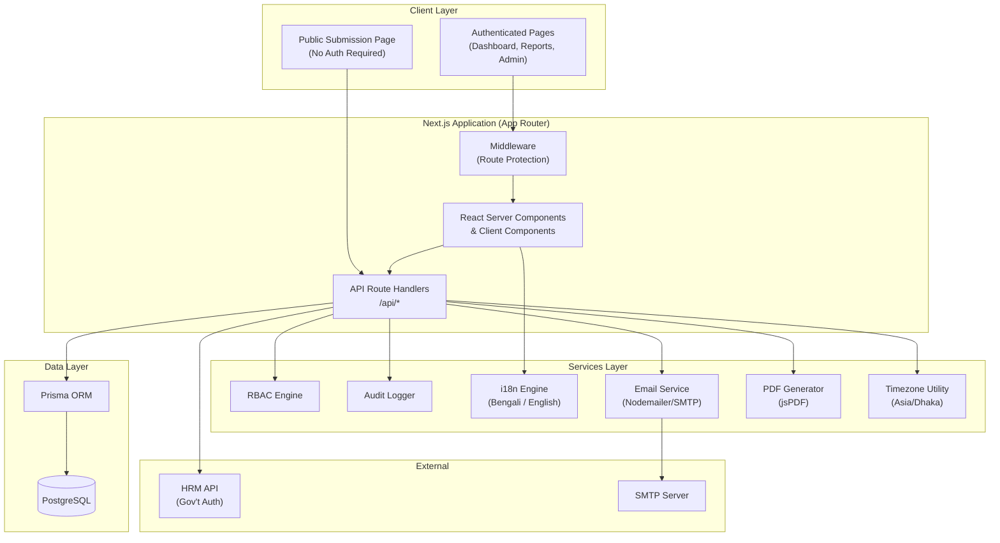
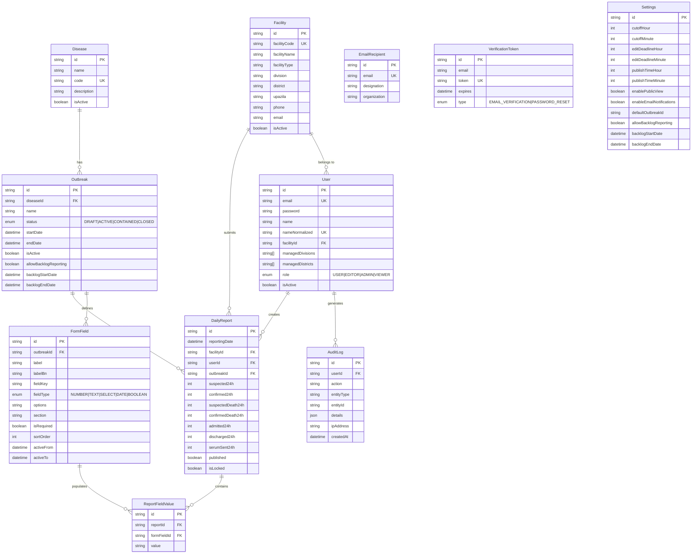
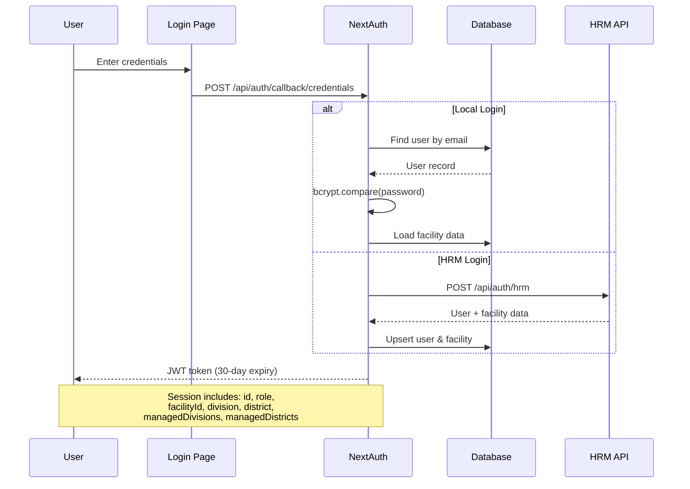
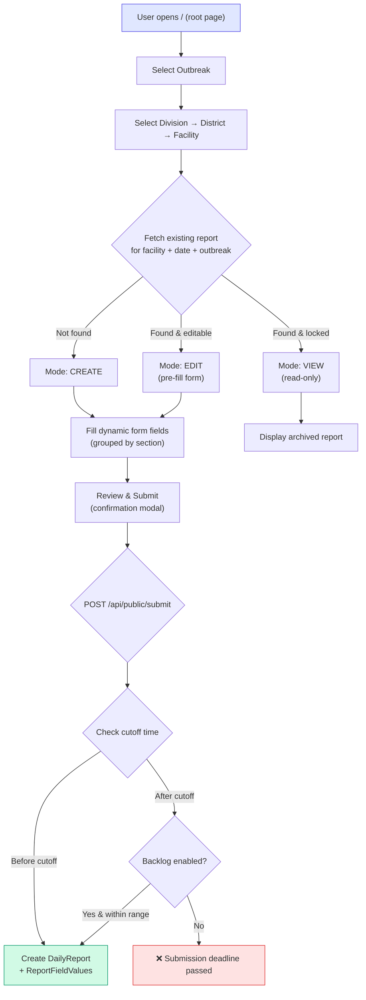
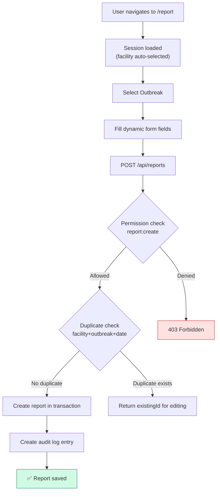
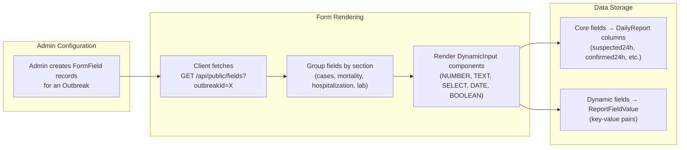
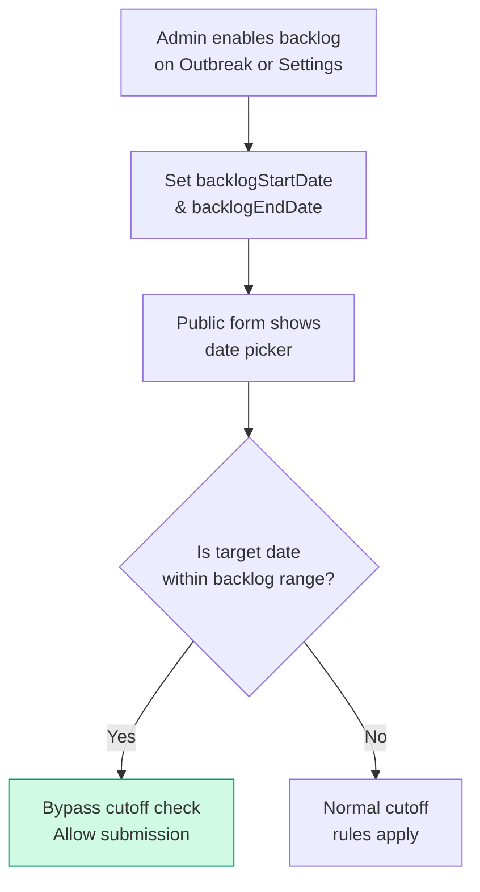

# Districtwise Measles Outbreak Monitoring Platform — System Architecture & Documentation

> **Version**: Current (as of April 2026)  
> **Stack**: Next.js 16 · React 19 · PostgreSQL · Prisma ORM · NextAuth.js  
> **Target Region**: Bangladesh (8 Divisions, 64 Districts)

---

## 1. High-Level Architecture



---

## 2. Technology Stack

| Layer | Technology | Version | Purpose |
|-------|-----------|---------|---------|
| **Runtime** | Node.js | 20+ | Server runtime |
| **Framework** | Next.js (App Router) | 16.2.2 | Full-stack React framework |
| **UI** | React | 19.2.4 | Component rendering |
| **Styling** | Tailwind CSS | 4.x | Utility-first CSS |
| **Database** | PostgreSQL | — | Relational data store |
| **ORM** | Prisma | 6.19.3 | Type-safe DB access |
| **Auth** | NextAuth.js | 4.24.13 | JWT-based authentication |
| **Charts** | Recharts | 3.8.1 | Time-series visualization |
| **Maps** | Leaflet / React-Leaflet | 1.9.4 / 5.0.0 | Geospatial outbreak mapping |
| **Animations** | Motion (Framer Motion) | 12.38.0 | UI micro-animations |
| **Icons** | Lucide React | 1.7.0 | Icon system |
| **Validation** | Zod | 4.3.6 | Schema validation |
| **PDF** | jsPDF + jspdf-autotable | 4.2.1 / 5.0.7 | Report export |
| **Excel** | xlsx (SheetJS) | 0.18.5 | Spreadsheet export |
| **i18n** | i18next + react-i18next | 26.0.4 / 17.0.2 | Bengali / English localization |
| **Email** | Nodemailer | 7.0.13 | Transactional email |
| **HTTP** | Axios | 1.14.0 | External API calls |
| **Date** | date-fns | 4.1.0 | Date manipulation |

---

## 3. Project Structure

```
📦 src/
├── 📁 app/                          # Next.js App Router
│   ├── 📄 layout.tsx                # Root layout (AuthProvider, I18nProvider)
│   ├── 📄 page.tsx                  # Public submission page (681 lines)
│   ├── 📄 globals.css               # Global styles
│   ├── 📁 (auth)/                   # Auth route group (no layout nesting)
│   │   ├── 📁 login/               # Login page (Local + HRM)
│   │   ├── 📁 register/            # User registration
│   │   ├── 📁 forgot-password/     # Password recovery request
│   │   └── 📁 reset-password/      # Password reset form
│   ├── 📁 (dashboard)/             # Authenticated route group
│   │   ├── 📄 layout.tsx           # Dashboard layout (Navbar + Footer)
│   │   ├── 📁 dashboard/           # Main dashboard (45KB — analytics heavy)
│   │   ├── 📁 report/              # Authenticated report submission
│   │   ├── 📁 my-reports/          # User's own report history
│   │   └── 📁 admin/               # Admin panel
│   │       ├── 📄 page.tsx          # Admin hub (card navigation)
│   │       ├── 📁 reports/          # Report management
│   │       ├── 📁 submissions/     # Submission tracking
│   │       ├── 📁 users/           # User account management
│   │       ├── 📁 settings/        # System settings (cutoff times)
│   │       ├── 📁 outbreaks/       # Outbreak management
│   │       ├── 📁 form-fields/     # Dynamic form field config
│   │       ├── 📁 outbreak-backlog/ # Backlog reporting controls
│   │       ├── 📁 recipients/      # Email recipient management
│   │       ├── 📁 bulk-data/       # Bulk CSV/data upload
│   │       └── 📁 data-management/ # Data cleanup & maintenance
│   └── 📁 api/                      # API Route Handlers
│       ├── 📁 auth/                 # Auth endpoints
│       │   ├── 📁 [...nextauth]/   # NextAuth handler
│       │   ├── 📁 hrm/             # HRM proxy auth
│       │   ├── 📁 register/        # Registration API
│       │   ├── 📁 verify/          # Email verification
│       │   ├── 📁 forgot-password/
│       │   └── 📁 reset-password/
│       ├── 📁 reports/              # Report CRUD
│       │   ├── 📄 route.ts         # GET (filtered), POST
│       │   ├── 📁 [id]/            # Single report operations
│       │   ├── 📁 geo/             # Geospatial aggregation
│       │   ├── 📁 timeseries/      # Time-series aggregation
│       │   └── 📁 my-reports/      # User-scoped reports
│       ├── 📁 public/               # Unauthenticated endpoints
│       │   ├── 📁 submit/          # Public report submission
│       │   ├── 📁 reports/         # Public report lookup
│       │   ├── 📁 outbreaks/       # Active outbreak list
│       │   └── 📁 fields/          # Dynamic form fields
│       ├── 📁 admin/                # Admin-only endpoints
│       │   ├── 📁 reports/         # All reports management
│       │   ├── 📁 users/           # User CRUD
│       │   ├── 📁 settings/        # System settings
│       │   ├── 📁 form-fields/     # Form field CRUD
│       │   ├── 📁 publish-reports/ # Bulk report publishing
│       │   ├── 📁 bulk-reports/    # Bulk upload API
│       │   ├── 📁 clean-data/      # Data cleanup
│       │   ├── 📁 fix-roles/       # Role correction
│       │   ├── 📁 user-stats/      # User statistics
│       │   └── 📁 cron/            # Scheduled tasks
│       │       └── 📁 daily-report/ # Daily report cron
│       ├── 📁 outbreaks/            # Outbreak CRUD
│       ├── 📁 diseases/             # Disease registry
│       ├── 📁 facilities/           # Facility lookup
│       ├── 📁 config/               # Public config endpoint
│       └── 📁 recipients/           # Email recipients CRUD
├── 📁 components/                    # Shared UI Components
│   ├── 📄 AuthProvider.tsx          # NextAuth SessionProvider
│   ├── 📄 I18nProvider.tsx          # i18next initialization
│   ├── 📄 Navbar.tsx                # Navigation bar (RBAC-aware)
│   ├── 📄 Footer.tsx                # Page footer
│   ├── 📄 OutbreakSelector.tsx      # Outbreak dropdown
│   ├── 📄 UnifiedReportForm.tsx     # Dynamic report form
│   ├── 📄 OutbreakMap.tsx           # Map container (SSR-safe)
│   ├── 📄 OutbreakMapInner.tsx      # Leaflet map (client-only)
│   ├── 📄 EpiInsights.tsx           # Epidemiological analytics
│   └── 📄 MarqueeBanner.tsx         # Scrolling news banner
├── 📁 lib/                           # Core Utilities
│   ├── 📄 auth.ts                   # NextAuth config (Credentials + HRM)
│   ├── 📄 prisma.ts                 # Prisma client singleton
│   ├── 📄 rbac.ts                   # Permission definitions & checks
│   ├── 📄 audit.ts                  # Audit logging system
│   ├── 📄 mail.ts                   # Email templates & sending
│   ├── 📄 timezone.ts              # Bangladesh time utilities
│   ├── 📄 constants.ts             # Division/District mappings
│   ├── 📄 i18n.ts                   # i18next configuration
│   ├── 📄 utils.ts                  # General utilities
│   ├── 📄 bd-districts.ts          # District coordinate data
│   ├── 📄 pdf-generate-report.ts   # Administrative PDF reports
│   ├── 📄 pdf-report-generator.ts  # User PDF reports
│   └── 📁 locales/
│       ├── 📄 bn.json               # Bengali translations (18KB)
│       └── 📄 en.json               # English translations (10KB)
└── 📁 types/
    └── 📄 next-auth.d.ts            # Session & JWT type augmentation
```

---

## 4. Database Schema (Entity Relationship)



### Key Constraints

| Constraint | Table | Fields |
|-----------|-------|--------|
| **Unique per outbreak per day per facility** | `DailyReport` | `(facilityId, outbreakId, reportingDate)` |
| **Unique field per outbreak** | `FormField` | `(outbreakId, fieldKey)` |
| **Unique value per report per field** | `ReportFieldValue` | `(reportId, formFieldId)` |
| **Cascade delete** | `ReportFieldValue → DailyReport` | `onDelete: Cascade` |

---

## 5. Authentication & Authorization

### 5.1 Authentication Flow



### 5.2 Role-Based Access Control (RBAC)

The system implements four roles with granular permissions:

| Permission | ADMIN | EDITOR | USER | VIEWER |
|-----------|:-----:|:------:|:----:|:------:|
| `report:create` | ✅ | ✅ | ✅ | ❌ |
| `report:read:own` | ✅ | ✅ | ✅ | ✅ |
| `report:read:all` | ✅ | ✅ | ❌ | ✅ |
| `report:update:own` | ✅ | ✅ | ✅ | ❌ |
| `report:update:any` | ✅ | ❌ | ❌ | ❌ |
| `report:delete` | ✅ | ❌ | ❌ | ❌ |
| `report:lock` | ✅ | ✅ | ❌ | ❌ |
| `report:publish` | ✅ | ✅ | ❌ | ❌ |
| `dashboard:view` | ✅ | ✅ | ✅ | ✅ |
| `dashboard:view:all` | ✅ | ✅ | ❌ | ✅ |
| `dashboard:view:scoped` | ❌ | ✅ | ❌ | ❌ |
| `dashboard:export` | ✅ | ✅ | ❌ | ✅ |
| `user:manage` | ✅ | ❌ | ❌ | ❌ |
| `settings:manage` | ✅ | ❌ | ❌ | ❌ |
| `outbreak:manage` | ✅ | ❌ | ❌ | ❌ |
| `formfield:manage` | ✅ | ❌ | ❌ | ❌ |
| `data:manage` | ✅ | ✅ | ❌ | ❌ |
| `audit:view` | ✅ | ❌ | ❌ | ❌ |

### 5.3 Data Scoping

Reports API automatically scopes data based on role:

- **USER** → Only sees their own facility's reports
- **EDITOR** → Sees reports from `managedDivisions[]` and `managedDistricts[]` (falls back to their own facility's division)
- **ADMIN / VIEWER** → Full access (ADMIN can filter by any division/district)

---

## 6. Core System Flows

### 6.1 Public Report Submission (Unauthenticated)



### 6.2 Authenticated Report Submission



### 6.3 Time-Based Submission Rules

```mermaid
gantt
    title Daily Submission Timeline (Bangladesh Time)
    dateFormat HH:mm
    axisFormat %H:%M

    section Submission Window
    New submissions accepted :active, 00:00, 14:00
    section Edit Window
    Editing allowed (next day) :active, 00:00, 10:00
    section Publish Window
    Auto-publish time        :milestone, 09:00, 0h
    section Cutoff
    Submission cutoff        :crit, 14:00, 0h
```



| Time Window | Default | Configurable | Description |
|------------|---------|:------------:|-------------|
| **Submission Cutoff** | 14:00 BDT | ✅ | New reports rejected after this time |
| **Edit Deadline** | 10:00 BDT (next day) | ✅ | Existing reports become read-only |
| **Publish Time** | 09:00 BDT | ✅ | Reports marked as published |
| **Backlog Override** | Disabled | ✅ per-outbreak | Bypasses cutoff for date ranges |

---

## 7. Dynamic Form Engine

The system uses a metadata-driven form engine where each outbreak defines its own set of reporting fields.



### Field Types

| Type | Rendered As | Storage |
|------|-----------|---------|
| `NUMBER` | `<input type="number">` | `ReportFieldValue.value` (string) |
| `TEXT` | `<input type="text">` | `ReportFieldValue.value` |
| `SELECT` | `<select>` with JSON options | `ReportFieldValue.value` |
| `DATE` | `<input type="date">` | `ReportFieldValue.value` |
| `BOOLEAN` | Checkbox (planned) | `ReportFieldValue.value` |

### Section Grouping

Fields are visually grouped and color-coded by `section`:

| Section | Icon | Color Gradient | Purpose |
|---------|------|---------------|---------|
| `cases` | Users | Blue → Indigo | Suspected/confirmed case counts |
| `mortality` | AlertTriangle | Red → Rose | Death counts |
| `hospitalization` | Hospital | Amber → Orange | Admission/discharge data |
| `lab` | FlaskConical | Purple → Violet | Laboratory/serum samples |

---

## 8. Dashboard & Analytics

### 8.1 Epidemiological Insights ([EpiInsights.tsx](file:///d:/districtwise-measles-outbreak-monitoring-platform/districtwise-measles-outbreak-monitoring-platform/src/components/EpiInsights.tsx))

| Metric | Calculation | Visualization |
|--------|-------------|---------------|
| **Reproduction Number (Rₜ)** | Simplified Cori method, serial interval = 12 days (measles-specific). `Rₜ = recent_cases / avg_past_serial_interval_cases` | Color-coded card (green < 0.95, amber 0.95–1.05, red > 1.05) |
| **Disease Trends** | Raw suspected vs confirmed cases over time | Dual line chart |
| **Growth Rate** | Day-over-day percentage change in confirmed cases | Single line chart |
| **7-Day Moving Average** | Sliding window average of confirmed cases | Layered line chart (raw + smoothed) |

### 8.2 Geospatial Mapping ([OutbreakMap.tsx](file:///d:/districtwise-measles-outbreak-monitoring-platform/districtwise-measles-outbreak-monitoring-platform/src/components/OutbreakMap.tsx))

- **Technology**: Leaflet with React-Leaflet wrapper
- **SSR**: Dynamically imported via `next/dynamic` with `ssr: false`
- **Data source**: `GET /api/reports/geo` — aggregated by district
- **Layers**: Toggle-able overlays for confirmed cases (purple), deaths (red), hospitalizations (orange)
- **Coordinates**: District centroids from [bd-districts.ts](file:///d:/districtwise-measles-outbreak-monitoring-platform/districtwise-measles-outbreak-monitoring-platform/src/lib/bd-districts.ts)

### 8.3 Dashboard Page Features

The main dashboard (`/dashboard`, 45KB) includes:

- **Summary statistics cards** — Total suspected, confirmed, deaths, hospitalizations
- **Outbreak selector** — Filter all data by active outbreak
- **Division/District filters** — Geographical scoping
- **Date range picker** — Historical data exploration
- **Epidemiological insight charts** — Trends, Rₜ, growth rate, moving averages
- **Interactive outbreak map** — Leaflet-based geospatial visualization
- **Report table** — Paginated, filterable, exportable (PDF / Excel)

---

## 9. API Reference

### 9.1 Public Endpoints (No Authentication)

| Method | Endpoint | Description |
|--------|---------|-------------|
| `GET` | `/api/public/outbreaks` | List active outbreaks |
| `GET` | `/api/public/fields?outbreakId=` | Get form fields for an outbreak |
| `GET` | `/api/public/reports?facilityId=&date=` | Check existing report for a facility |
| `POST` | `/api/public/submit` | Submit new daily report |
| `PUT` | `/api/public/submit?existingId=` | Update existing report |
| `GET` | `/api/config?outbreakId=` | Get system settings + backlog config |
| `GET` | `/api/facilities?division=&district=` | Facility lookup by location |
| `GET` | `/api/diseases` | List diseases |

### 9.2 Authenticated Endpoints

| Method | Endpoint | Required Role | Description |
|--------|---------|:------------:|-------------|
| `GET` | `/api/reports` | Any authenticated | Fetch reports (RBAC-scoped) |
| `POST` | `/api/reports` | `report:create` | Create report (facility-bound) |
| `GET` | `/api/reports/[id]` | `report:read:own` | Get single report |
| `PUT` | `/api/reports/[id]` | `report:update:own` | Update report |
| `GET` | `/api/reports/geo` | Any authenticated | Geospatial aggregation |
| `GET` | `/api/reports/timeseries?days=` | Any authenticated | Time-series data |
| `GET` | `/api/reports/my-reports` | `report:read:own` | User's own reports |
| `GET/POST` | `/api/outbreaks` | AUTH / `outbreak:manage` | Outbreak management |
| `PATCH` | `/api/outbreaks` | `outbreak:manage` | Update outbreak (incl. backlog) |
| `GET/POST/DELETE` | `/api/recipients` | ADMIN | Email recipients |

### 9.3 Admin-Only Endpoints

| Method | Endpoint | Description |
|--------|---------|-------------|
| `GET/PUT/DELETE` | `/api/admin/reports` | Full report management |
| `GET/POST/PUT/DELETE` | `/api/admin/users` | User account management |
| `GET/PUT` | `/api/admin/settings` | System settings |
| `GET/POST/PUT/DELETE` | `/api/admin/form-fields` | Dynamic form field CRUD |
| `POST` | `/api/admin/publish-reports` | Bulk publish reports |
| `POST` | `/api/admin/bulk-reports` | Bulk CSV upload |
| `POST` | `/api/admin/clean-data` | Data cleanup operations |
| `POST` | `/api/admin/fix-roles` | Role correction utility |
| `GET` | `/api/admin/user-stats` | User activity statistics |
| `POST` | `/api/admin/cron/daily-report` | Trigger daily report generation |

---

## 10. Internationalization (i18n)

| Feature | Implementation |
|---------|---------------|
| **Languages** | Bengali (`bn`) — default, English (`en`) |
| **Library** | i18next + react-i18next + browser language detector |
| **Persistence** | `localStorage` |
| **Toggle** | Language switch button in Navbar and public page |
| **Fallback** | Bengali (`bn`) |
| **Coverage** | Navigation, dashboard labels, admin panel, form sections, epidemiological metrics |

Translation files:
- [bn.json](file:///d:/districtwise-measles-outbreak-monitoring-platform/districtwise-measles-outbreak-monitoring-platform/src/lib/locales/bn.json) — 18KB (comprehensive Bengali translations)
- [en.json](file:///d:/districtwise-measles-outbreak-monitoring-platform/districtwise-measles-outbreak-monitoring-platform/src/lib/locales/en.json) — 10KB (English translations)

---

## 11. Audit & Compliance

### Audit Log Actions

All significant operations are tracked in the `AuditLog` table:

| Category | Actions |
|----------|---------|
| **Reports** | `REPORT_CREATE`, `REPORT_UPDATE`, `REPORT_DELETE`, `REPORT_PUBLISH`, `REPORT_UNPUBLISH`, `REPORT_LOCK`, `REPORT_UNLOCK` |
| **Users** | `USER_LOGIN`, `USER_LOGOUT`, `USER_CREATE`, `USER_UPDATE`, `USER_DELETE`, `USER_ROLE_CHANGE` |
| **System** | `SETTINGS_UPDATE`, `OUTBREAK_CREATE`, `OUTBREAK_UPDATE`, `FORM_FIELD_CREATE`, `FORM_FIELD_UPDATE` |
| **Data Ops** | `DATA_CLEAN`, `BULK_UPLOAD`, `CSV_IMPORT` |

Each audit entry captures: `userId`, `action`, `entityType`, `entityId`, `details` (JSON), `ipAddress`, and `createdAt` timestamp.

---

## 12. Email Notifications

The system sends transactional emails via SMTP (Nodemailer) for the following events:

| Email Type | Trigger | Template |
|-----------|---------|----------|
| **Email Verification** | New user registration | Verification link with token |
| **Password Reset** | Forgot password request | Reset link with token |
| **Account Created** | Admin creates user | Credentials + login link |
| **Account Status** | Admin activates/deactivates account | Status notification |

> [!NOTE]
> Email sending degrades gracefully — if SMTP is not configured, emails are logged to the console with mock IDs, allowing development without an SMTP server.

---

## 13. Report Export

### PDF Generation

Two PDF generators using jsPDF + jspdf-autotable:

| Generator | Use Case | Contents |
|-----------|---------|----------|
| [pdf-generate-report.ts](file:///d:/districtwise-measles-outbreak-monitoring-platform/districtwise-measles-outbreak-monitoring-platform/src/lib/pdf-generate-report.ts) | Administrative overview | Summary totals, CFR, confirmation rate, hospitalization efficiency, facility-level table |
| [pdf-report-generator.ts](file:///d:/districtwise-measles-outbreak-monitoring-platform/districtwise-measles-outbreak-monitoring-platform/src/lib/pdf-report-generator.ts) | User's own reports | Personal summary, date-ordered table |

### Excel Export

Excel/CSV export available via the `xlsx` (SheetJS) library for bulk data download from dashboard and admin views.

---

## 14. Backlog Reporting

Backlog reporting allows submission of reports for past dates, overriding normal cutoff rules.



Configuration levels:
1. **Global** (`Settings` table) — applies system-wide
2. **Per-outbreak** (`Outbreak` table) — overrides global for specific outbreaks

---

## 15. Bangladesh Geographic Coverage

The system covers all 8 administrative divisions and their 64 districts:

| Division | District Count | Districts |
|----------|:-----------:|-----------|
| **Barishal** | 6 | Barguna, Barishal, Bhola, Jhalokathi, Patuakhali, Pirojpur |
| **Chattogram** | 11 | Bandarban, Brahmanbaria, Chandpur, Chattogram, Cox's Bazar, Cumilla, Khagrachhari, Lakshmipur, Noakhali, Rangamati, Feni |
| **Dhaka** | 13 | Dhaka, Faridpur, Gazipur, Gopalganj, Kishoreganj, Madaripur, Manikganj, Munshiganj, Narayanganj, Narsingdi, Rajbari, Shariatpur, Tangail |
| **Khulna** | 10 | Bagerhat, Chuadanga, Jashore, Jhenaidah, Khulna, Kushtia, Magura, Meherpour, Narail, Satkhira |
| **Mymensingh** | 4 | Jamalpur, Mymensingh, Netrokona, Sherpur |
| **Rajshahi** | 8 | Bogura, Chapainawabganj, Joypurhat, Naogaon, Natore, Pabna, Rajshahi, Sirajganj |
| **Rangpur** | 8 | Dinajpur, Gaibandha, Kurigram, Lalmonirhat, Nilphamari, Panchagarh, Rangpur, Thakurgaon |
| **Sylhet** | 4 | Habiganj, Moulvibazar, Sunamganj, Sylhet |

---

## 16. Security Considerations

| Area | Implementation |
|------|---------------|
| **Password Hashing** | bcryptjs (cost factor 10) |
| **Session Strategy** | JWT (30-day expiry), httpOnly cookies |
| **Cookie Security** | `secure: true` in production, `sameSite: lax` |
| **API Protection** | `getServerSession()` check on all authenticated routes |
| **RBAC Enforcement** | `hasPermission()` / `requirePermission()` on every API handler |
| **Data Scoping** | Queries automatically filtered by user's role and geographic scope |
| **Input Validation** | Zod schemas, numeric coercion, SQL injection protection via Prisma parameterized queries |
| **Report Locking** | `isLocked` flag prevents unauthorized modifications |
| **Audit Trail** | All state-changing operations logged with user ID and IP |
| **HRM Integration** | External government auth system as SSO alternative |

---

## 17. Deployment & Configuration

### Environment Variables

| Variable | Purpose |
|----------|---------|
| `DATABASE_URL` | PostgreSQL connection string |
| `NEXTAUTH_SECRET` | JWT signing secret |
| `NEXTAUTH_URL` | Application base URL |
| `SMTP_HOST` | Email server hostname |
| `SMTP_PORT` | Email server port |
| `SMTP_USER` | Email account username |
| `SMTP_PASS` | Email account password |
| `NEXT_PUBLIC_CONTROL_ROOM_CONTACT` | Control room contact info |

### Build & Run

```bash
# Development
npm run dev

# Production build (includes Prisma generate)
npm run build    # → prisma generate && next build

# Production serve
npm start
```

### Database Seeding

```bash
# Seed admin user + facility accounts + default settings
npx tsx prisma/seed.ts

# Seed outbreak form configurations
node prisma/seed-forms.js
```

Default admin credentials: `admin@monitor.org` / `admin@321`

---

## 18. Key Design Decisions

| Decision | Rationale |
|---------|-----------|
| **Dual submission path** (public + authenticated) | Health facilities in remote areas may not have user accounts; public endpoint allows any facility to report using facility code alone |
| **Dynamic form fields** (EAV pattern) | Different disease outbreaks require different data fields; avoids schema migrations when tracking new diseases |
| **Per-outbreak backlog configuration** | Different outbreaks may need different historical data entry windows |
| **Bangladesh timezone hardcoded** | System is exclusively for Bangladesh surveillance; avoids timezone ambiguity |
| **7 fixed + N dynamic report columns** | Core epidemiological metrics (suspected, confirmed, death, admitted, discharged, serum) are indexed columns for performance; outbreak-specific fields use the flexible EAV `ReportFieldValue` table |
| **Bengali as default language** | Primary user base is Bangla-speaking health workers |
| **Leaflet over Google Maps** | Open-source, no API key required, works offline |
| **JWT over database sessions** | Stateless auth scales better for distributed deployment |
